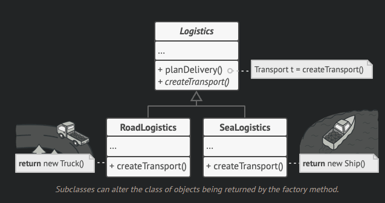
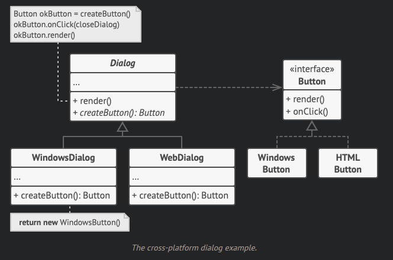

# Creational Patterns

Patterns of creating flexible structures of data.

## Factory Method

Creational design pattern providing an interface for creating objects in a superclass, but allows subclasses to alter the type of objects created.

### Problem 

Most code is tied to a single class, when adding a new class with components requiring similar classes, there is a need to lots of changes to the existing codebase in order to decouple and couple classes together.

### Solution

Replace direct object construction calls (new operator/constructors) with calls to a special factory method. Objects returned by a factory method are referred to as products.

All products must follow the same interface, implementing high-level methods independently.

- Code using the factory method (the client) doesn't see differences between actual products returned by various subclasses
  - All treated as an abstract `Transport` (higher-level class)
  - How it works is not important

### Applicability

- Unknown exact types and dependencies of the objects your code should work with
- Provide users of library/framework with a way to extend its internal components
- Save system resources by reusing existing objects

### Pros / Cons

- Avoid tight coupling
- Single responsibility principle
- Open/closed principle
- Code becomes more complicated